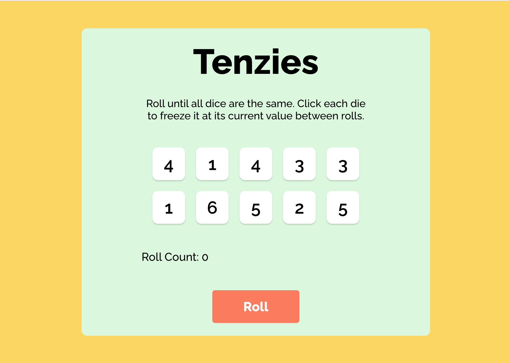

  
  <h1></h1>
  
  <h3>Roll until all dice are the same</h3>

  <h3><a href="https://margos-tenzies.netlify.app/">Try me!</a></h3>

  

  
  

## Technologies Used

&nbsp;&nbsp;&nbsp;&nbsp;&nbsp;&nbsp;

## Description

 Tenzi is a dice game used to demonstrate the use of React Hooks (useState, useEffect).

The player needs to roll dice until they are all the same. Clicking on a dice, freezes it at its current value between rolls.

## Screenshots

